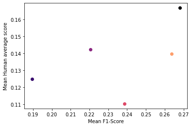

# Linear Probing for Reinforcement Learning

Evaluating representations computed by a pretrained encoder is a difficult task. Assessing improvements in a reinforcement learning task is one possibility but those results suffer a high level of uncertainty, which requires running with multiple seeds thus making it computationally expensive. Our evaluation task is a simple
Imitation Learning task where we train linear probe of the encoder, i.e. a linear layer following a frozen encoder, that is faster, usually requiring less than an hour per game or task, and with results that are less prone to uncertainty.


This code is prepared to do evaluations hover Atari games using the actions and observations from the DQN Replay dataset, however, the `evaluate_repr.py`` should be agnostic to the task so that adapting it to different environments is easy, only requiring changing the PyTorch Dataset class.

## Running

The code was designed to be imported:

```python
from evaluate_encoder import evaluate

model = CNN("some/pretrained_weights.pth")
evaluate_representations(encoder, dataset_path)
```

## Validation

Our initial use for this evaluation was to evaluate pretrained `ViT tiny` using several self-supervised methods for images and simple extension of VICReg (TOV-VICReg) that uses Shuffle and Learn to learn temporal relations between observations. We compare against a random classifier, three randomly initialized encoders and non frozen encoder (trained for 300 epochs) that we use as goal score. The following table presents the result we have obtained:

| game           |   Random Classifier |   Nature CNN |   ResNet |    ViT |   ViT+TOV-VICReg |   ViT+DINO |   ViT+MoCo |   ViT+VICReg |   No Freeze |
|----------------|---------------------|--------------|----------|--------|------------------|------------|------------|--------------|-------------|
| Alien          |              0.0556 |       0.0077 |   0.0558 | 0.0147 |           0.1003 |     0.0470 |     0.0646 |       0.0695 |      0.1021 |
| Assault        |              0.1519 |       0.1497 |   0.2270 | 0.1770 |           0.3044 |     0.2536 |     0.2557 |       0.3704 |      0.6673 |
| BankHeist      |              0.0608 |       0.0780 |   0.1312 | 0.0756 |           0.1622 |     0.1059 |     0.1083 |       0.1467 |      0.2080 |
| Breakout       |              0.2509 |       0.1311 |   0.3850 | 0.2183 |           0.3285 |     0.3591 |     0.2765 |       0.4077 |      0.5907 |
| ChopperCommand |              0.0563 |       0.0145 |   0.0647 | 0.0176 |           0.3225 |     0.0383 |     0.2019 |       0.1298 |      0.2660 |
| Freeway        |              0.3999 |       0.6808 |   0.6850 | 0.6843 |           0.7041 |     0.6850 |     0.6972 |       0.6971 |      0.8885 |
| Frostbite      |              0.0565 |       0.0302 |   0.0730 | 0.0367 |           0.1021 |     0.0517 |     0.0744 |       0.0664 |      0.1019 |
| Kangaroo       |              0.0603 |       0.0311 |   0.1039 | 0.0562 |           0.2184 |     0.0877 |     0.1374 |       0.1259 |      0.3311 |
| MsPacman       |              0.1121 |       0.0388 |   0.1419 | 0.0780 |           0.1527 |     0.1215 |     0.1168 |       0.1400 |      0.2063 |
| Pong           |              0.1644 |       0.0692 |   0.1702 | 0.0718 |           0.2853 |     0.1447 |     0.2730 |       0.2337 |      0.4340 |
| Mean           |              0.1369 |       0.1231 |   0.2038 | 0.1430 |           0.2680 |     0.1894 |     0.2206 |       0.2387 |      0.3796 |

We validate the evaluation task using the scores obtained by the Rainbow algorithm using the different pretrained encoders. Early results show some correlation.

| Pearson Correlation Coefficient |
|---------------------------------|
| 0.5276                          |



